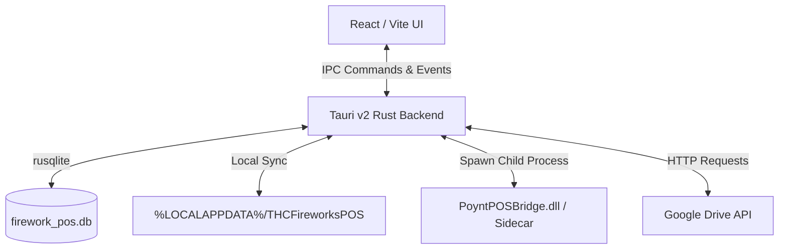

# 🛠️ THC Fireworks POS — Developer & Architecture Guide

Welcome to the **THC Fireworks POS** developer onboarding and architecture guide. This document details the system design, database layout, Tauri command APIs, and core frontend/backend integrations to make code maintenance and future feature additions as straightforward as possible.

---

## 🏗️ System Architecture Overview

The application is structured as a local-first desktop application using **Tauri v2** (Rust) as the native shell and **React / Vite / TypeScript** for the user interface.



### Key Technology Stack
1. **Frontend Core**: React 18, TypeScript, Tailwind CSS, Lucide icons.
2. **Backend Shell**: Tauri v2, Rust.
3. **Database Engine**: SQLite (via `rusqlite` with the `bundled` feature, compiling SQLite directly into the output executable for zero external dependency runtime).
4. **Portability Shell**: Runs directly off standard USB drives, creating a local database in the same directory as the executable on startup.

---

## 💾 Portability & Recovery Architecture

To ensure data integrity when running directly off temporary USB flash drives:
- **Executable-Relative Paths**: The database connection string is dynamically constructed relative to the running binary using `std::env::current_exe()`.
- **Automatic Backup Sync**: Upon database modifications, a shadow copy of the database is synced to `%LOCALAPPDATA%\THCFireworksPOS\` automatically.
- **Database Self-Healing**: If the database file is deleted or lost from the USB drive, the application checks the local AppData backup folder on startup, auto-restores the latest backup, and updates the application settings with a `restored_from_backup` flag, triggering a confirmation banner on the UI.

---

## 🗄️ SQLite Database Schema

The database contains the following tables:

### 1. `items`
Stores the product inventory, pricing, case bulk pack variants, and reference links.
- `id` (INTEGER, Primary Key)
- `barcode` (TEXT, Unique, indexed)
- `name` (TEXT, Indexed)
- `price` (REAL)
- `stock_quantity` (INTEGER, Optional/Nullable: Null signals untracked stock)
- `notes` (TEXT, Optional)
- `bulk_price` (REAL, Optional)
- `bulk_barcode` (TEXT, Optional)
- `bulk_quantity` (INTEGER, Optional)
- `unit_cost` (REAL, Optional)
- `tax_id` (INTEGER, Foreign Key referencing `taxes.id`)
- `video_path` (TEXT, Optional: Local path or YouTube URL)
- `discount_tags` (TEXT, Optional comma-separated categories)

### 2. `taxes`
Configures tax rates.
- `id` (INTEGER, Primary Key)
- `name` (TEXT)
- `rate` (REAL, e.g. 7.0 for 7.0%)
- `scope` (TEXT, "total" or "item")

### 3. `discounts`
Custom promotion engine rules.
- `id` (INTEGER, Primary Key)
- `name` (TEXT)
- `type` (TEXT, "percentage" or "fixed")
- `value` (REAL)
- `qualifier_type` (TEXT: "item_quantity", "order_total", or "manual")
- `qualifier_value` (REAL)
- `reward_type` (TEXT: "item_discount_qty", "item_discount_all", "lowest_cost_item", "items_for_price", "order_discount")
- `reward_value` (REAL)
- `reward_value_type` (TEXT: "percentage" or "fixed")
- `reward_quantity` (REAL)
- `reward_target_item_id` (INTEGER)
- `reward_lowest_cost_linked_item_id` (INTEGER)
- `discount_tag` (TEXT)
- `max_limit_per_order` (INTEGER)
- `value_cap` (REAL)
- `is_stackable` (INTEGER, 0 = False, 1 = True)

### 4. `sales` & `sale_items`
Transactions ledger tracking customer receipts.
- `sales` table: `id`, `timestamp`, `subtotal`, `discount_total`, `tax_total`, `final_total`, `payment_method`, `godaddy_transaction_id`, `transaction_fee`, `status`.
- `sale_items` table: `id`, `sale_id` (FK), `item_id` (FK), `quantity`, `price_at_sale`, `is_bulk`.

### 5. `settings`
Key-value storage for parameters (e.g. `receipt_header`, `receipt_footer`, `godaddy_terminal_ip`, `admin_password_hash`, `theme_config`).

### 6. `payment_methods`
Payment methods with optional surcharge fee structures. Includes fields: `id`, `name`, `enabled`, `fee_percentage`, `fee_flat`, `is_custom`, `status`.

---

## 🔌 Tauri IPC Bridge (Rust Commands)

Frontend scripts interact with Rust using `invoke("command_name", { arguments })`. The primary backend entrypoint is [src-tauri/src/lib.rs](file:///c:/Users/Jacobs-Desktop/OneDrive/Projects/THCFireworksPOS/src-tauri/src/lib.rs).

Key APIs registered inside `tauri::generate_handler!`:

| Area | Command Name | Purpose |
| :--- | :--- | :--- |
| **Catalog** | `get_items`, `add_item`, `update_item`, `delete_item` | Manage inventory catalog |
| **Sales** | `add_sale`, `get_sales`, `delete_sale` | Add and audit checkout transactions |
| **Settings** | `get_settings`, `save_setting`, `verify_admin_password` | Key-value settings and password gates |
| **Backup** | `backup_db`, `restore_db`, `oauth_exchange` | Local backups and Google Drive OAuth integration |
| **GoDaddy** | `pair_godaddy_terminal`, `start_godaddy_checkout` | IPC hook to Poynt Smart Terminal bridge |
| **Data Sync** | `export_csv_table`, `import_csv_table` | Data migrations via CSV spreadsheets |
| **System** | `simulate_system_date`, `clear_database_table` | Developer console simulation triggers |

---

## ⚡ Core Frontend Systems

### 1. Barcode Wedge Scanner & Modal Interceptor
Point-of-Sale scanning uses physical keyboard wedge devices (which act as high-speed keyboards finishing with an `Enter` suffix).
- **Global Keypress Capture**: [ScannerListener.tsx](file:///c:/Users/Jacobs-Desktop/OneDrive/Projects/THCFireworksPOS/src/components/ScannerListener.tsx) intercepts events globally.
- **Wedge Detection**: Keystrokes with intervals `< 100ms` are appended to a buffer. Gaps `> 150ms` clear the buffer.
- **De-Duplication**: Prevents issues where buggy scanner firmware double-submits characters.
- **Modal Gating**: Interceptor terminates character collection if standard HTML dialog inputs are focused or if overlay elements matching `.fixed.z-50` exist on screen.

### 2. Showcase Secondary Monitor Screen
Volunteers can toggle a separate Customer Showcase screen.
- **Multi-Window Sync**: Clicking the showcase toggle instantiates a secondary borderless Tauri window (`PlaybackWindow`).
- **Synchronized Commands**: Media playing triggers, pauses, sound controls, and timelines are communicated bi-directionally between the register dashboard and the customer monitor window via Tauri global events.
- **yt-dlp Offline Cache**: When a developer or manager registers a YouTube URL for a firework demo, the Rust backend invokes `yt-dlp` to download the high-definition video directly next to the database, allowing local offline playback in seasonal tents with poor internet connectivity.

### 3. GoDaddy Poynt Smart Terminal Integration
Pairs card transaction terminals directly over local Wi-Fi.
- **Sidecar Bridge Process**: Rust backend launches `PoyntPOSBridge.dll` locally using standard IO pipelines.
- **Transaction Gating**: The frontend initiates checkouts, and the Rust backend communicates the ticket price to the bridged terminal, awaiting payment authorization or failure responses before logging the sale.

### 4. Custom Discount & Pricing Rules Engine
Handles layered pricing calculations:
- Resolves whether items should charge standard or bulk case pricing (based on scan inputs or manual toggle states).
- Resolves tax groupings dynamically (total-scope vs item-scope taxation rules).
- Calculates multi-item rewards, BOGO (Buy One Get One) triggers, manual override presets (e.g. Church Member, Military discount), and stackable/non-stackable caps.

---

## 🛠️ Local Development & Build Commands

Execute these scripts in standard terminals inside the workspace:

### Install Dependencies
```bash
npm install
```

### Launch Development Environment
Launches the hot-reloaded React UI running inside a Tauri shell:
```bash
npm run tauri dev
```

### Build Production Bundle
Generates a highly-optimized, single portable executable:
```bash
npm run tauri build
```

---

## 🧪 Testing Guidelines

Unit tests reside adjacent to React components in `__tests__` subfolders:
- Run frontend tests:
  ```bash
  npm run test
  ```
- Tests are executed using **Vitest** and **React Testing Library**.
